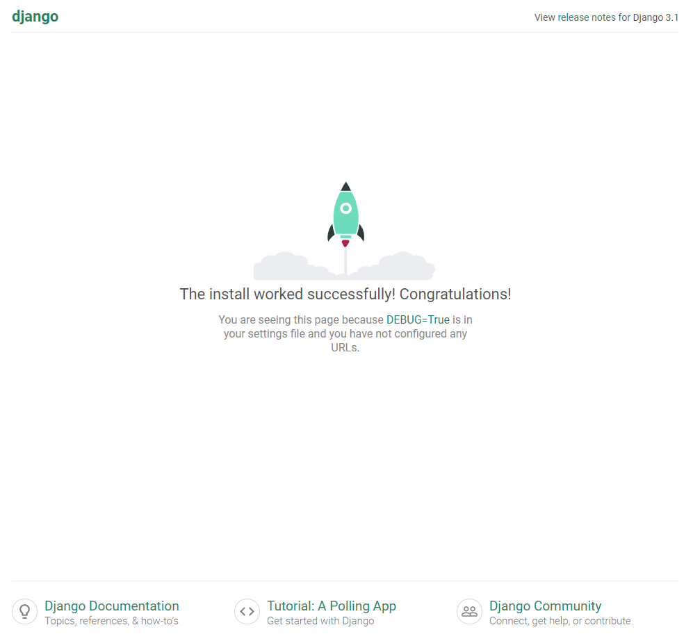
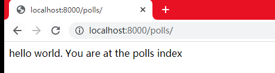
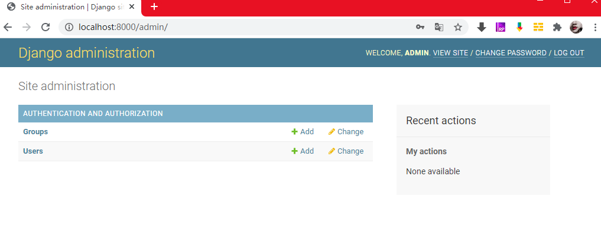
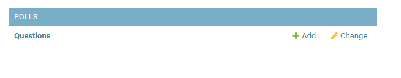
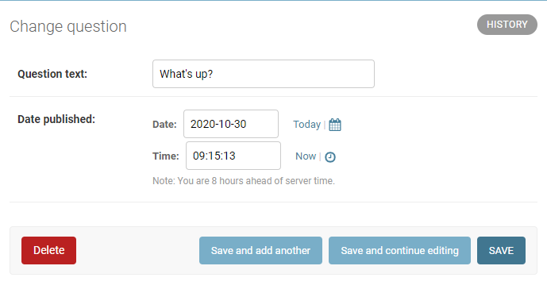

# 投票应用程序

[TOC]

## 项目描述

这是一个投票应用程序

它将由两部分组成：
- 一个让人们查看和投票的公共站点
- 一个让你能添加、修改和删除投票的管理站点

## 技术说明

前后端采用一体化的Python 3.7.9 + Django 3.1.2

### 环境安装

安装虚拟环境，指定Python版本和Django版本。
```bash
conda create -n datavisual37 python=3.7.9 Django=3.1.2
conda activate datavisual37
```
如果是想安装Django的开发版本
```bash
git clone https://github.com/django/django.git
pip install -e django/  
```
 -e 是指的本地项目路径. 

查看Django版本
```bash
python -m django --version
```
初始化项目
```bash
django-admin startproject mysite
```
这时候可以进入mysite项目，然后启动项目
```bash
cd mysite
python manage.py runserver
```
如果出现以下的提示信息，则证明环境和项目初始化成功了
```bash
Watching for file changes with StatReloader
Performing system checks...

System check identified no issues (0 silenced).

You have 18 unapplied migration(s). Your project may not work properly until you apply the migrations for app(s): admin, auth, contenttypes, sessions.
Run 'python manage.py migrate' to apply them.
October 30, 2020 - 09:57:39
Django version 3.1.2, using settings 'mysite.settings'
Starting development server at http://127.0.0.1:8000/
Quit the server with CTRL-BREAK.
```
现在，服务器正在运行，浏览器访问 https://127.0.0.1:8000/。你将会看到一个"祝贺"页面，随着一只火箭发射，服务器已经运行了。



> 图片在GitHub上无法显示

如果需要更换端口，则在后面加上端口
```bash
python manage.py runserver 8080
```
如果要更换ip，则在端口前加上
```bash
python manage.py runserver 0:8000
```
其中，0 是 0.0.0.0 的简写。

在修改项目的文件内容后，runserver会自动重新加载Python代码。只有在新加的文件的时候，才需要重启服务器。

### 创建应用

在 Django 中，每一个应用都是一个 Python 包，并且遵循着相同的约定。

- 应用是一个专门做某件事的网络应用程序——比如博客系统，或者公共记录的数据库，或者小型的投票程序。
- 项目则是一个网站使用的配置和应用的集合。项目可以包含很多个应用。应用可以被很多个项目使用。

Django 自带一个工具，可以帮你生成应用的基础目录结构，这样你就能专心写代码，而不是创建目录了。

我们将在你的 manage.py 同级目录下创建投票应用。这样它就可以作为顶级模块导入，而不是 mysite 的子模块。

现在在manage.py的同级目录下，执行如下命令，创建应用。

```bash
python manage.py startapp polls
```
这时候就新建了一个和manage.py 同级的Python包：polls
它的目录结构如下
```bash
polls/
    __init__.py
    admin.py
    apps.py
    migrations/
        __init__.py
    models.py
    tests.py
    views.py
```

#### 修改应用

编写视图文件 `polls/views.py`
```python
from django.http import HttpResponse


def index(request):
    return HttpResponse("hello world. You are at the polls index")

```
创建文件: `polls/urls.py`
```python
from django.urls import path

from . import views

urlpatterns = [
    path('', views.index, name='index')
]

```
urls.py文件是用来映射url地址和视图的，使得打开相应的地址就能获取视图返回的内容。

修改文件：`mysite/urls.py`，以声明我们新添加的应用的url
```python
from django.contrib import admin
from django.urls import path, include

urlpatterns = [
    path('polls/', include('polls.urls')),
    path('admin/', admin.site.urls),
]
```

现在，我们完整的添加了一个页面的url，及其返回的内容，看看效果

```bash
cd mysite
python manage.py runserver

```
打开url：`http://localhost:8000/polls/`，就能看到views.py中返回的字符串



刚刚我们打开`mysite/urls.py`的时候, 其实还有一个默认的路径：`admin/`，这个其实是Django自身的管理页面，需要登录才能使用。
后面在讲到模型的时候，创建账户和密码后就能使用。

#### path()函数

现在先研究一下`from django.urls import path`中的`path`函数。

`path`函数有四个参数，前面两个是必须的参数：route 和 view

- route  

  route是一个匹配url准则

- view  

  这个是对应的视图

- name参数  

  为你的 URL 取名能使你在 Django 的任意地方唯一地引用它，尤其是在模板中。
  这个有用的特性允许你只改一个文件就能全局地修改某个 URL 模式。

### 数据库配置

对应的文件：`mysite/settings.py`

这里面有狠多值得注意的地方，

- INSTALLED_APPS，这里面是默认启动的应用
    - django.contrib.admin -- 管理员站点， 你很快就会使用它。
    - django.contrib.auth -- 认证授权系统。
    - django.contrib.contenttypes -- 内容类型框架。
    - django.contrib.sessions -- 会话框架。
    - django.contrib.messages -- 消息框架。
    - django.contrib.staticfiles -- 管理静态文件的框架。

- DATABASES，这里面是数据库引擎设置

    engine的可选值常见如下：
  
    - django.db.backends.sqlite3
    - django.db.backends.postgresql
    - django.db.backends.mysql
    - django.db.backends.oracle

    name是数据库的名称，如果选择的sqlite，则它就是电脑上的一个文件，应该给出其路径，包括文件名。
    
    如果不使用 SQLite，则必须添加一些额外设置，比如 USER 、 PASSWORD 、 HOST 等等。
    

INSTALLED_APPS中默认开启的某些应用需要至少一个数据表，所以，在使用他们之前需要在数据库中创建一些表。

请执行以下命令
```bash
python manage.py migrate
```
这个 migrate 命令检查 INSTALLED_APPS 设置，为其中的每个应用创建需要的数据表

至于具体会创建什么，这取决于你的 mysite/settings.py 设置文件和每个应用的数据库迁移文件。

migrate 命令只会为在 INSTALLED_APPS 里声明了的应用进行数据库迁移。如果不需要的话，可以在执行命令前删掉。


### 创建模型

在 Django 里写一个数据库驱动的 Web 应用的第一步是定义模型 - 也就是数据库结构设计和附加的其它元数据。

在这个投票应用中，需要创建两个模型，问题 Question 和选项 Choice。

- Question 模型包括问题描述和发布时间

- Choice 模型有两个字段，选项描述和当前得票数。每个选项属于一个问题。

下面，编辑`polls/models.py`文件

```python
from django.db import models


class Question(models.Model):
    question_text = models.CharField(max_length=200)
    pub_date = models.DateTimeField('date published')


class Choice(models.Model):
    question = models.ForeignKey(Question, on_delete=models.CASCADE)
    choice_text = models.CharField(max_length=200)
    votes = models.IntegerField(default=0)
```
这就分别定义好了我们需要的2个模型。其中，我们用ForeignKey定义了一个外键，意思就是每个Choice对象都关联到一个Question对象。

### 激活模型
激活模型的目的有2个

- 为这个应用创建数据库 schema（生成 CREATE TABLE 语句）。

- 创建可以与 Question 和 Choice 对象进行交互的 Python 数据库 API。

我们先把polls应用安装到我们的项目里，就像那些默认应用被安装的方式一样。

我们可以看到，在`polls/apps.py`中有一个初始化时创建的类：`PollsConfig`

我们要做的是，在mysite/settings.py中的INSTALLED_APPS里面加进去

```python
INSTALLED_APPS = [
    'polls.apps.PollsConfig',
    'django.contrib.admin',
    'django.contrib.auth',
    'django.contrib.contenttypes',
    'django.contrib.sessions',
    'django.contrib.messages',
    'django.contrib.staticfiles',
]
```
然后执行命令

```bash
python manage.py makemigrations polls
```
它会提示
```bash
Migrations for 'polls':
  polls\migrations\0001_initial.py
    - Create model Question
    - Create model Choice
```
makemigrations并没有真正创建模型，而是检测你对模型文件的修改，并且把修改的部分存储为一次迁移，作为py文件保存到polls/migrations/文件夹下。

里面的迁移脚本是按编号来生成的，当前第一次生成了：`0001_initial.py`

执行下面的命令
```bash
python manage.py sqlmigrate polls 0001
```
能看到详细的迁移过程（相当于查看日志）
```SQL
BEGIN;

-- Create model Question

CREATE TABLE "polls_question" ("id" integer NOT NULL PRIMARY KEY AUTOINCREMENT, "question_text" varchar(200) NOT NULL, "pub_date" datetime NOT NULL);

-- Create model Choice

CREATE TABLE "polls_choice" ("id" integer NOT NULL PRIMARY KEY AUTOINCREMENT, "choice_text" varchar(200) NOT NULL, "votes" integer NOT NULL, "question_id" integer NOT NULL REFERENCES "polls_question" ("id") DEFERRABLE INITIALLY DEFE
RRED);

CREATE INDEX "polls_choice_question_id_c5b4b260" ON "polls_choice" ("question_id");

COMMIT;

```
观察后，我们可以得到以下几点结论：

- 数据库的表名是由应用名(polls)和模型名的小写形式( question 和 choice)连接而来

- 主键(IDs)会被自动创建


执行下面的命令，可以检查项目中的问题

```bash
python manage.py check
```

最后，运行migrate命令，即可完成模型在数据库里面的创建。

```bash
python manage.py migrate
```

会看到如下的提示信息

```bash
Operations to perform:
  Apply all migrations: admin, auth, contenttypes, polls, sessions
Running migrations:
  Applying polls.0001_initial... OK
```

这个 migrate 命令选中所有还没有执行过的迁移,并应用在数据库上 - 也就是将你对模型的更改同步到数据库结构上。

Django 会通过在数据库中创建一个特殊的表 django_migrations 来跟踪执行过哪些迁移。

迁移是非常强大的功能，它能让你在开发过程中持续的改变数据库结构而不需要重新删除和创建表，它专注于使数据库平滑升级而不会丢失数据。

### 更改模型

现在，你只需要记住，改变模型需要这三步：

- 编辑 `models.py` 文件，改变模型。
- 运行 `python manage.py makemigrations` 为模型的改变生成迁移文件。
- 运行 `python manage.py migrate` 来应用数据库迁移。

### API

执行如下命令可以进入交互命令行

```bash
python manage.py shell
```

试试如下的命令
```python
# manage.py shell中，Django会根据配置来设置包的导入路径，所以不用担心找不到模型。

from polls.models import Choice, Question

# 显示Question里面的所有记录，相当于select *
Question.objects.all()

from django.utils import timezone  # 推荐Django处理时区后的这个工具

# 创建了一个问题对象
q = Question(question_text="What's new?", pub_date=timezone.now())

q.save()

q.id

q.question_text

q.pub_date

q.question_text = "What's up?"

q.save()

Question.objects.all()

Question.objects.filter(id=1)

current_year = timezone.now().year

Question.objects.get(pub_date__year=current_year)

Question.objects.get(id=2) # 这个会出错，因为还没有id=2的记录

Question.objects.get(pk=1)  # 使用pk和id是等价的，pk就是根据主键来获取记录

q = Question.objects.get(pk=1)

q.was_published_recently()

q.choice_set.all()

# 从这里我就没太理解，choice_set是从哪来的，也没定义这个方法啊

q.choice_set.create(choice_text='Not much', votes=0)

q.choice_set.create(choice_text='The sky', votes=0)

c = q.choice_set.create(choice_text='Just hacking again', votes=0)

c.question

q.choice_set.all()

q.choice_set.count()

Choice.objects.filter(question__pub_date__year=current_year)

c = q.choice_set.filter(choice_text__startswith='Just hacking')
```

我们在中间的时候，对polls/models.py进行了修改，增加了2个方法，重新进入shell后就起作用了。

```python
from django.db import models
import datetime
from django.utils import timezone


class Question(models.Model):
    question_text = models.CharField(max_length=200)
    pub_date = models.DateTimeField('date published')

    def __str__(self):
        return self.question_text

    def was_published_recently(self):
        return self.pub_date >= (timezone.now() - datetime.timedelta(days=1))


class Choice(models.Model):
    question = models.ForeignKey(Question, on_delete=models.CASCADE)
    choice_text = models.CharField(max_length=200)
    votes = models.IntegerField(default=0)

    def __str__(self):
        return self.choice_text

```
` __str__()`是内置方法，我们对它进行重写，使得返回的对象可以更清晰的被查看。

### Django管理界面

创建账号
```bash
python manage.py createsuperuser

#username: admin
#password: admin
```

启动服务
```bash
python manage.py runserver
```

浏览器输入地址：`http://localhost:8000/admin/`

然后输入用户名和密码，即可进入默认的管理界面。




2020-11-01 周日，开始记录下面的学习过程


进入管理界面后，可以看到一些开源编辑的内容，这些是由`django.contrib.auth`提供的。


#### 在管理界面添加新用

编辑`polls/admin.py`

```python
from django.contrib import admin

from .models import Question

admin.site.register(Question)
```

这样就注册好了Question类，而且在管理界面可以看到它：




点击"Questions"，可以看到一个"Questions"的列表，

这里面是目前数据库里面所有已存在的"Questions"对象，我们可以在这里进行修改。



现在可以看到这个"Questions"实例"what's up?"的一些属性。

- 不同的字段类型有不同的显示方式，也会有不同的控件，这个表单是Django自动生成的

进行修改后，可以点击下面的几个按钮进行保存，也可以通过点击右上角的“History”按钮查看该实例的修改历史。

### 视图

#### 建立视图

Django 中的视图：一类具有相同功能和模板的网页的集合。

我们先来试试，编辑`polls/views.py`
```python
from django.http import HttpResponse


def index(request):
    return HttpResponse("hello world. You are at the polls index")


def detail(request, question_id):
    return HttpResponse("You are looking at question %s." % question_id)


def results(request, question_id):
    response = "You are looking at the result of question %s."
    return HttpResponse(response % question_id)


def vote(request, question_id):
    return HttpResponse("You're voting on question %s." % question_id)
```

然后把这些视图添加进`polls.urls`模块，其实就是添加几个url函数，将url映射到视图。

编辑`polls/urls.py`

```python
from django.urls import path

from . import views

urlpatterns = [
    path('', views.index, name='index'),  # ex: /polls/
    path('<int:question_id>/',views.detail,name="detail"), # ex: /polls/1/
    path('<int:question_id>/results',views.results,name="results"), # ex: /polls/1/results
    path('<int:question_id>/vote',views.vote,name="vote"), # ex: /polls/1/results
]
```
这样的话，在浏览器打开相应的url，就能显示视图函数返回的消息
```html
http://127.0.0.1:8000/polls/34/
http://127.0.0.1:8000/polls/34/results
http://127.0.0.1:8000/polls/34/vote
```

在此，我们需要说明一下，path里面的`<int:question_id>`其实是一种参数的写法，在调用视图函数的时候，我们会把这个参数传进去。

比如在浏览`http://127.0.0.1:8000/polls/34/`的时候，其实就是在匹配urlpatterns里面的第二项`path('<int:question_id>/',views.detail,name="detail")`，
然后调用的是函数`detail(request=<HttpRequest object>, question_id=34)`。

这里关于url和视图的逻辑详情我们可以先了解这么多。

#### 视图进阶

上面我们的视图返回的内容仅仅是我们预设好的一段字符串，并不是一个丰富的网页。

接下来，我们首先要明白，Django要求视图返回的是一个`HttpResponse`对象，或者抛出一个异常。

至于`HttpResponse`对象里面包含的内容是什么，Django并不关心，但用户关心。

下面，我们将丰富`HttpResponse`对象的内容。


---

最后更新时间：2020-11-02

